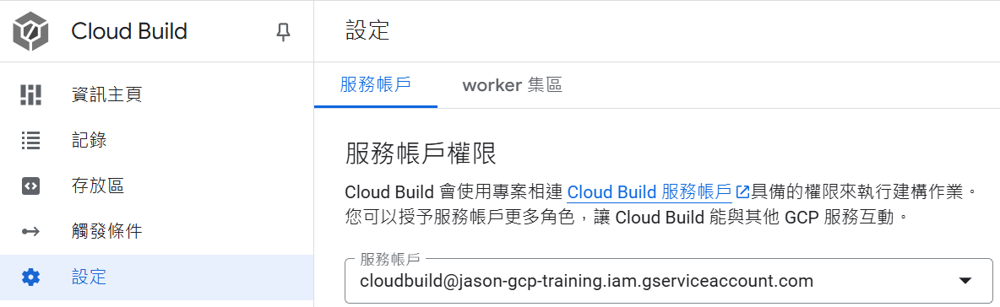
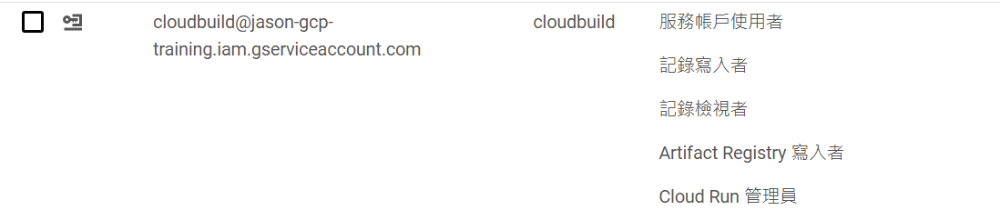

# Cloud Build

## Getting Started
**利用 Cloud Build 關連到 Gitlab 並執行 CI/CD。**

### Prerequisites
**本身的帳號一定要可以讓 build 讀取 secret 的權限**
* Cloud Run
* Cloud Build
* Artifact Registry
* Secret Manager
* Gitlab Personal access token
* Service account



### Installing
**1. clone repository 到 local。**
```shell
git clone https://gitlab.com/q5040842/cloudbuild.git
```

### Usage
**1. 設定好觸發條件後，更改並上傳即會觸發 cloud build**


### Reference
https://cloud.google.com/build/docs/automating-builds/gitlab/connect-host-gitlab-enterprise-edition?hl=zh-cn
